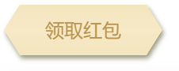
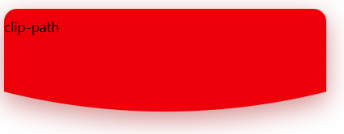

不规则形状 `clip-path` 导致 `box-shadow` 阴影无效。那么怎么给 `clip-path` 切出的不规则形状容器添加阴影呢？使用 `drop-shadow`。

## 使用 `clip-path` 裁剪显示形状

```html
<div class="btn">领取红包</div>
```

```css
.btn {
  content: '';
  width: 200px;
  height: 64px;
  line-height: 64px;
  text-align: center;
  background: linear-gradient(#f5e5bf, #fbe8c8, #f5e5bf);
  color: #be9451;
  font-size: 24px;
  clip-path: polygon(10% 0%, 90% 0%, 100% 50%, 90% 100%, 10% 100%, 0 50%);
  /* box-shadow: inset 0px 0px 1px 1px #fff; */
}
```

在该按钮元素上使用 `box-shadow` 无效。

## 给裁剪的形状添加阴影

首先我们需要给上面按钮元素添加一个容器

```html
<div class="btn-wrap">
  <div class="btn">领取红包</div>
</div>
```

然后对容器应用蒙版投影效果

```css
.btn-wrap {
  margin: auto;
  filter: drop-shadow(2px 4px 3px rgba(50, 50, 0, 0.5));
}
```

这样我们就得到了一个带有阴影效果的不规则形状元素。



## 另一个示例

```html
<style>
  .content-wrap {
    margin-top: 12px;
    filter: drop-shadow(0px 10px 16px rgb(222, 141, 141));
  }

  .content {
    width: 400px;
    height: 100px;
    background-color: red;
    border-radius: 16px 16px 0 0;
    clip-path: ellipse(820px 820px at 50% calc(100% - 820px));
    padding: 12px 0 16px;
  }
</style>

<div class="content-wrap">
  <div class="content">clip-path</div>
</div>
```

效果如下图：



---

[CodePen 示例](https://codepen.io/wtto00/pen/NWOJVbe?editors=1100)

内容蒙版投影：[MDN drop-shadow](https://developer.mozilla.org/zh-CN/docs/Web/S/filter-function/drop-shadow)

裁剪元素的可显示区域：[MDN clip-path](https://developer.mozilla.org/zh-CN/docs/Web/CSS/clip-path)
