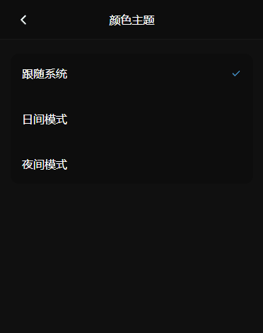

实现功能：

1. `暗色模式`、`亮色模式`、`跟随系统`，三种主题设置正常工作
2. 主题设置后永久保存在本地，下次进入后，读取保存的设置
3. 切换主题时，加载扩散渐变动画，如下图所示：



多亏了 CSS 新特性 [View Transitions API](https://developer.mozilla.org/zh-CN/docs/Web/API/View_Transitions_API)，使我们能够实现这种扩散的动画。

## 初始化 `MediaQueryList` 对象

```ts
const mediaQueryList: MediaQueryList = window.matchMedia('(prefers-color-scheme: dark)');
```

这个对象主要用于判断当前系统是否是暗色模式，以及监听系统主题暗色模式的改变。

## 读取本地保存的主题设置

```ts
/** 三种主题设置 */
type ColorScheme = 'OS' | 'Dark' | 'Light';

/**
 * 判断主题设置是否合法
 * OS: 跟随系统
 * Dark: 暗色模式
 * Light: 亮色模式
 */
function isColorScheme(color: string): color is ColorScheme {
  return color === 'OS' || color === 'Dark' || color === 'Light';
}

const localColorScheme = localStorage.getItem('colorScheme') ?? '';
// 如果本地保存的主题值不合法，则使用默认的 `跟随系统` 主题
const colorScheme = isColorScheme(localColorScheme) ? localColorScheme : 'OS';
```

## 设置页面主题

### 判断当前页面的主题

这里我们使用根元素的 `class` 是否包含 `dark` 来判断，页面的 css 样式，也要根据此判断来应用不同主题的样式。

```ts
/**
 * 当前主题色是否是暗色
 */
function isDark() {
  return document.documentElement.classList.contains('dark');
}
```

### 判断当前系统的主题

```ts
/**
 * 当前系统的主题色是否是暗色/深色/夜间
 */
function systemIsDark() {
  return mediaQueryList.matches;
}
```

### 监听系统主题的变化

如果页面主题设置了跟随系统，那么当系统主题改变的时候，页面主题也要相应的跟随改变。

所以当页面主题设置为跟随系统时，就要监听主题色改变，当系统主题色改变时，执行页面的切换主题方法 `toggleTheme`。当页面主题设置为亮色或暗色，而不是跟随系统时，就要取消已监听的主题色改变方法。

```ts
/**
 * 监听系统主题色的改变
 */
function listenSystemTheme() {
  if (mediaQueryList.addListener) {
    // 兼容旧版浏览器，将来会被废弃
    mediaQueryList.addListener(toggleTheme);
  } else {
    // 新版浏览器
    mediaQueryList.addEventListener('change', toggleTheme);
  }
}

/**
 * 取消监听系统主题色的改变
 */
function unListenSystemTheme() {
  if (mediaQueryList.removeListener) {
    // 兼容旧版浏览器，将来会被废弃
    mediaQueryList.removeListener(toggleTheme);
  } else {
    // 新版浏览器
    mediaQueryList.removeEventListener('change', toggleTheme);
  }
}
```

### 开始设置页面主题

用户点击切换主题按钮，或者刚进入页面根据本地保存的设置，来进行设置主题。

```ts
/**
 * 当前页面的主题设置
 * 未初始化前为空
 */
let colorScheme: ColorScheme;

/**
 * 设置主题模式
 * @param scheme 要设置的主题
 * @param event 用户点击切换主题按钮的点击事件
 */
function setColorScheme(scheme: ColorScheme, event?: MouseEvent) {
  // 如果当前页面的主题设置和要设置的主题一致，则不执行
  if (colorScheme === scheme) return;
  // 当前页面主题是否是暗色
  const currentDark = isDark();
  switch (scheme) {
    case 'OS':
      // 设置主题色跟随系统
      // 当前系统主题是否是暗色
      const systemDark = systemIsDark();
      // 当前主题色与系统主题色不一致时，切换主题
      if (currentDark !== systemDark) {
        toggleTheme(event);
      }
      // 从不是 `跟随系统` 的设置，改变为 `跟随系统`，添加监听方法
      listenSystemTheme();
      break;
    case 'Dark':
      // 设置主题色为暗色模式
      // 当前页面主题色不是暗色的话，则切换主题
      if (!currentDark) {
        toggleTheme(event);
      }
      // 从 `跟随系统` 的设置，改变为暗色主题，取消掉之前的监听方法
      if (colorScheme === 'OS') {
        unListenSystemTheme();
      }
      break;
    case 'Light':
      // 亮色模式
      // 当前页面主题色是暗色的话，则切换主题
      if (currentDark) {
        toggleTheme(event);
      }
      // 从 `跟随系统` 的设置，改变为亮色主题，取消掉之前的监听方法
      if (colorScheme === 'Light') {
        unListenSystemTheme();
      }
      break;
  }
  // 永久化保存设置
  localStorage.setItem('colorScheme', scheme);
  // 标记当前页面的主题设置
  colorScheme = scheme;
}
```

## 切换页面主题

### 添加类型支持

```ts
/**
 * document.startViewTransition 新特性，ts暂不包括
 * @link https://developer.mozilla.org/en-US/docs/Web/API/Document/startViewTransition
 */
interface ViewTransition {
  ready: Promise<void>;
}
interface Document {
  startViewTransition: (callback: () => void) => ViewTransition;
}
```

### 切换页面主题 class

```ts
/**
 * 切换主题色，html标签切换dark类
 */
function toggleDark() {
  document.documentElement.classList.toggle('dark');
}
```

### 判断用户是否开启了动画减弱功能

如果用户开启了动画减弱，则不加载 `ViewTransition` 动画。一般情况下，省电模式会默认开启此选项。

```ts
/**
 * 检测用户的系统是否被开启了动画减弱功能
 * @link https://developer.mozilla.org/zh-CN/docs/Web/CSS/@media/prefers-reduced-motion
 */
function isReducedMotion() {
  return window.matchMedia(`(prefers-reduced-motion: reduce)`).matches === true;
}
```

### 开始切换页面主题

```ts
/**
 * 切换主题色，扩散渐变动画
 * @param event 点击事件
 */
function toggleTheme(event?: MouseEvent) {
  // 如果当前页面是暗色，则切换为亮色；如果当前页面是亮色，则切换为暗色
  const willDark = !isDark();
  // 浏览器新特性不支持 或者 开启了动画减弱
  if (!document.startViewTransition || isReducedMotion()) {
    toggleDark();
    return;
  }

  // 开始加载 ViewTransition 扩散动画
  const transition = document.startViewTransition(() => {
    toggleDark();
  });

  // 传入点击事件，从点击处开始扩散。否则，从右上角开始扩散
  const x = event?.clientX ?? window.innerWidth;
  const y = event?.clientY ?? 0;

  const endRadius = Math.hypot(Math.max(x, innerWidth - x), Math.max(y, innerHeight - y));
  void transition.ready.then(() => {
    const clipPath = [`circle(0px at ${x}px ${y}px)`, `circle(${endRadius}px at ${x}px ${y}px)`];
    document.documentElement.animate(
      {
        clipPath: willDark ? clipPath : [...clipPath].reverse(),
      },
      {
        duration: 500,
        easing: 'ease-in',
        pseudoElement: willDark ? '::view-transition-new(root)' : '::view-transition-old(root)',
      },
    );
  });
}
```

## 扩散动画相关的 CSS

```css
/** Animated Theme Toggle */
::view-transition-old(root),
::view-transition-new(root) {
  animation: none;
  mix-blend-mode: normal;
}

.dark::view-transition-old(root) {
  z-index: 1;
}
.dark::view-transition-new(root) {
  z-index: 999;
}

::view-transition-old(root) {
  z-index: 999;
}
::view-transition-new(root) {
  z-index: 1;
}
```

## 完整示例

[CodePen 示例](https://codepen.io/wtto00/pen/XWydaZx)
