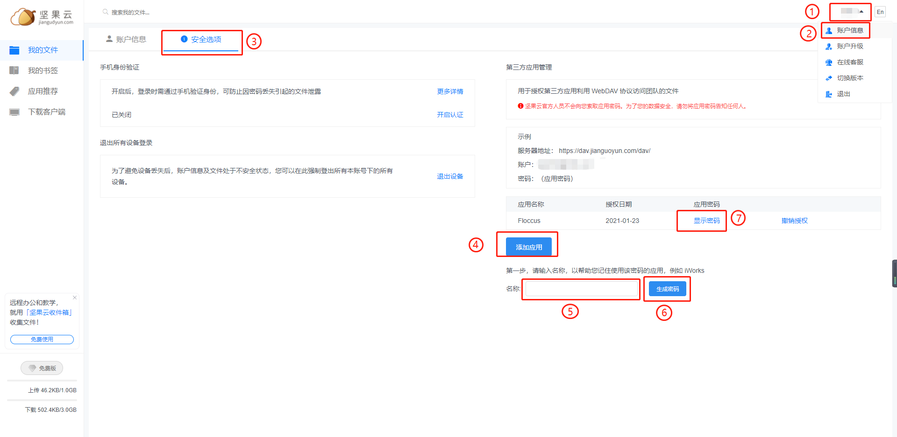
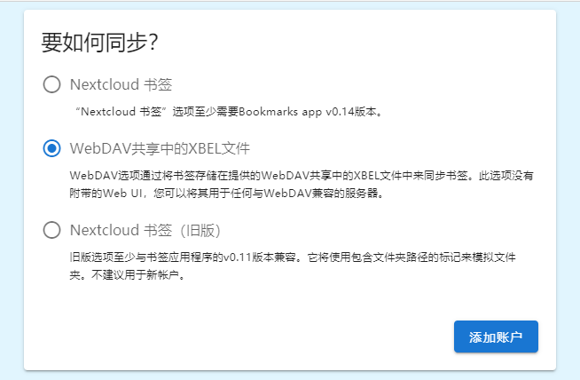
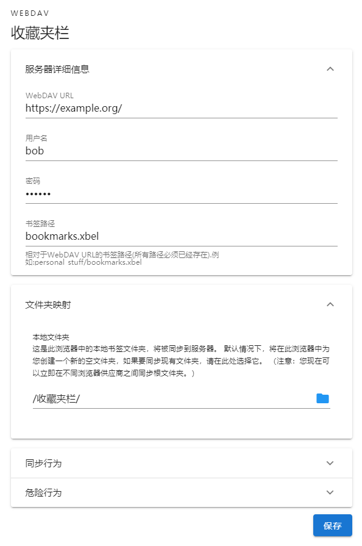

Floccus 浏览插件是一款能够实现跨浏览器进行书签同步的浏览插件。

该插件可支持 Chrome 和 Firefox 浏览器使用，插件可以通过 Nextcloud，WebDAV 或本地文件 (以及任何文件同步解决方案) 实现跨浏览器同步书签，非常实用！

如果你想要将 Chrome 里的书签同步到 Firefox，就可以来使用这款 Floccus 浏览插件使用！

👉 官网 <https://floccus.org/>

## 下载安装

上面 👆 官网也有下载链接：  
[floccus 在 Firefox 插件商店](https://addons.mozilla.org/en-US/firefox/addon/floccus/)  
[floccus 在 Chrome 插件商店](https://chrome.google.com/webstore/detail/floccus/fnaicdffflnofjppbagibeoednhnbjhg>)  
[floccus 在 Edge 插件商店](https://microsoftedge.microsoft.com/addons/detail/gjkddcofhiifldbllobcamllmanombji)

> Chrome 商店被墙，可以安装插件 <https://iguge.app/>

## 坚果云 WebDAV 同步

这里说下通过坚果云 WebDAV 协议来同步浏览器书签：

1. 打开[坚果云](https://www.jianguoyun.com/#/)并登录
1. 添加坚果云 WebDAV 协议的应用，如下图所示
   
   按照上图所示顺序，添加应用，获取应用密码。
1. 创建你想要把同步的浏览器书签保存的位置。
   比如，你想要把同步的文件保存位置为 `/Bookmarks/bookmarks.xbel`，则需要先创建目录 `Bookmarks`
1. 设置 Floccus 插件
   首先这里选择第二项 “WebDAV 共享中的 XBEL 文件”，点击添加账户
   
   
   - “WebDAV URL” 填第 2 步中右侧示例中的服务器地址：<https://dav.jianguoyun.com/dav/>
   - “用户名” 填第 2 步中右侧示例中的账户：xxx
   - “密码” 填第 2 步最后获取的应用密码
   - “书签路径” 填第 3 步中自己想要同步的书签文件保存在坚果云的位置
   - “文件夹映射” 选择 “收藏夹栏”。不选的话，默认会创建一个空文件夹，同步的书签在创建的文件夹中
