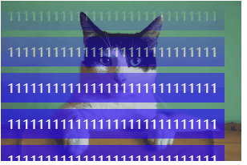

> mask 遮罩，使用一张图片或者渐变色做为遮罩，所在元素的透明度会跟随遮罩的透明度。

```html
<div class="wrap">
  <ul class="container">
    <li>1111111111111111111111111111</li>
    <li>1111111111111111111111111111</li>
    <li>1111111111111111111111111111</li>
    <li>1111111111111111111111111111</li>
    <li>1111111111111111111111111111</li>
    <li>1111111111111111111111111111</li>
    <li>1111111111111111111111111111</li>
    <li>1111111111111111111111111111</li>
    <li>1111111111111111111111111111</li>
    <li>1111111111111111111111111111</li>
    <li>1111111111111111111111111111</li>
    <li>1111111111111111111111111111</li>
    <li>1111111111111111111111111111</li>
    <li>1111111111111111111111111111</li>
    <li>1111111111111111111111111111</li>
    <li>1111111111111111111111111111</li>
    <li>1111111111111111111111111111</li>
    <li>1111111111111111111111111111</li>
  </ul>
</div>
```

```css
.wrap {
  width: 300px;
  height: 200px;
  background-image: url(../../assets/images/cat.jpg);
  background-repeat: no-repeat;
  background-size: cover;
  background-position: center;
}
.container {
  height: 100%;
  overflow-y: auto;
  list-style: none;
  padding-left: 0;
  position: relative;
  margin: 0;
  -webkit-mask: linear-gradient(transparent, #000 60%);
  scrollbar-width: none;
}
.container::-webkit-scrollbar {
  display: none;
}
.container li {
  width: fit-content;
  background: rgba(0 0 255 / 60%);
  margin-bottom: 8px;
  color: #fff;
  padding: 8px;
  box-sizing: border-box;
}
```

[codepen](https://codepen.io/wtto00/pen/OJOGMpm?editors=1100)
