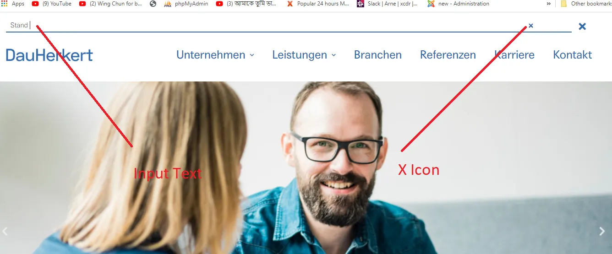

参考 [How to Remove “X” icon from search input field or input type search](https://medium.com/@rion.mrk/how-to-remove-x-icon-from-search-input-field-or-input-type-search-db3c808405fb)。



如上图所示，当 `input` 类型为 `search` 时，聚焦后，浏览器会在 `input` 末尾显示一个清除的图标。可添加下面的 `css`，可隐藏该图标。

```css
/* clears the ‘X’ from Internet Explorer */
input[type='search']::-ms-clear {
  display: none;
  width: 0;
  height: 0;
}
input[type='search']::-ms-reveal {
  display: none;
  width: 0;
  height: 0;
}
/* clears the ‘X’ from Chrome */
input[type='search']::-webkit-search-decoration,
input[type='search']::-webkit-search-cancel-button,
input[type='search']::-webkit-search-results-button,
input[type='search']::-webkit-search-results-decoration {
  display: none;
}
```
